# Wassy-Talk Chat Application

Wassy-Talk is a feature-rich chat application that allows users to communicate in real-time, create group chats, and manage their profiles. This README provides information on setting up and running both the frontend and backend components of the application.

## Table of Contents

1. [Features](#features)
2. [Screenshots](#screenshots)
3. [Tech Stack](#tech-stack)
4. [Prerequisites](#prerequisites)
5. [Installation](#installation)
   - [Backend Setup](#backend-setup)
   - [Frontend Setup](#frontend-setup)
6. [Environment Variables](#environment-variables)
7. [Running the Application](#running-the-application)
8. [API Endpoints](#api-endpoints)
9. [Socket.IO Events](#socketio-events)
10. [Admin Functionality](#admin-functionality)
11. [Contributing](#contributing)
12. [License](#license)

## Features

- User authentication (signup, login)
- Real-time messaging
- One-on-one chat
- Group chat creation and management
- User profile management
- User search functionality
- Admin panel for user management
- Account deletion
- Notifications
- Image upload using Cloudinary
- Mobile-responsive design

## Screenshots

Here are some screenshots showcasing the key features of Wassy-Talk:

### Login

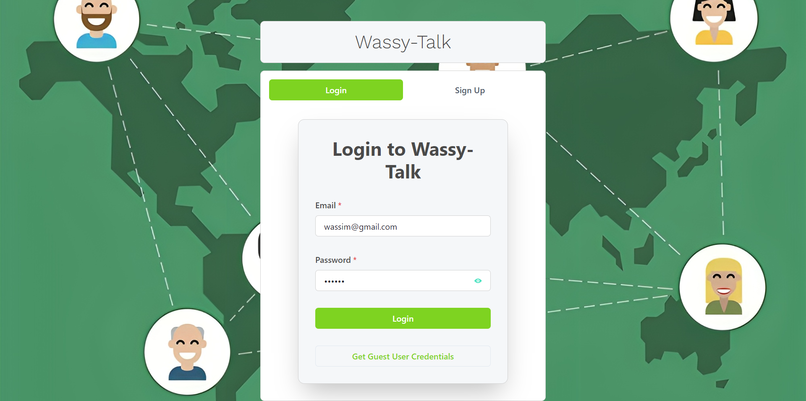
_Description: The login screen where users can enter their credentials to access the application._

### Signup

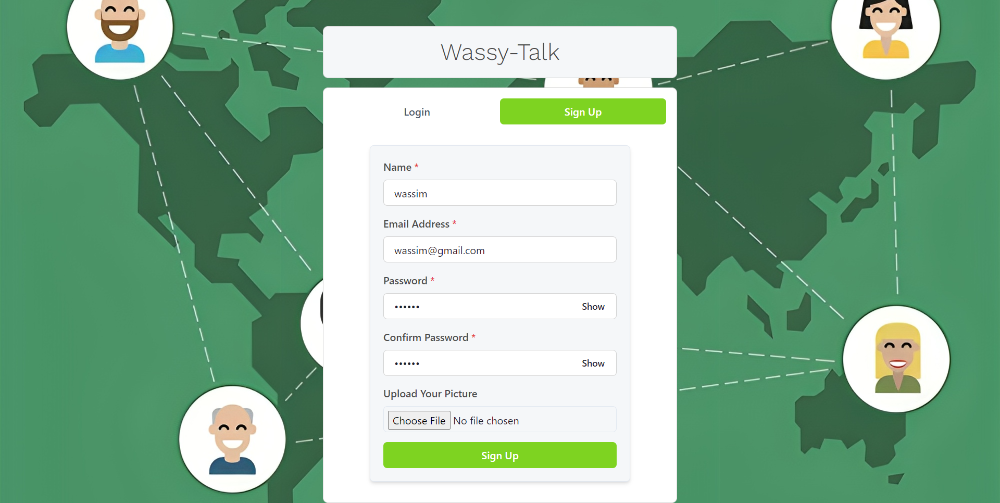
_Description: The signup screen where new users can create an account._

### Chat Home

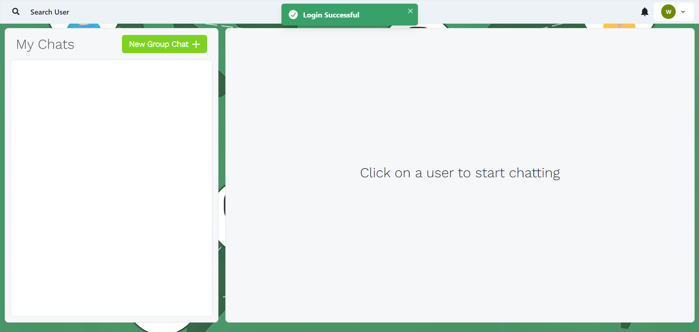
_Description: The main chat interface showing recent conversations and options to start new chats._

### User Profile

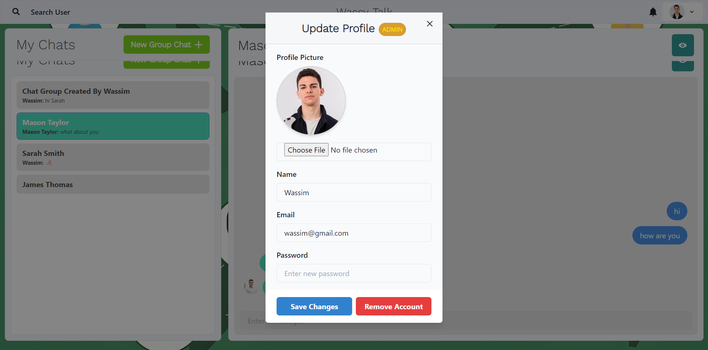
_Description: The user profile page where users can view and edit their information._

### User Profile View

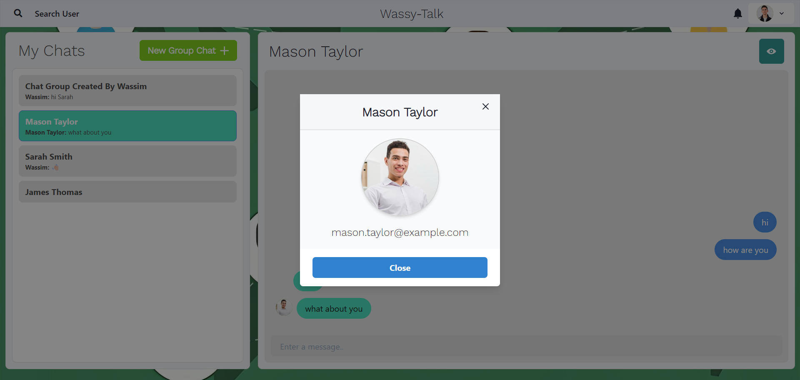

### Search Users

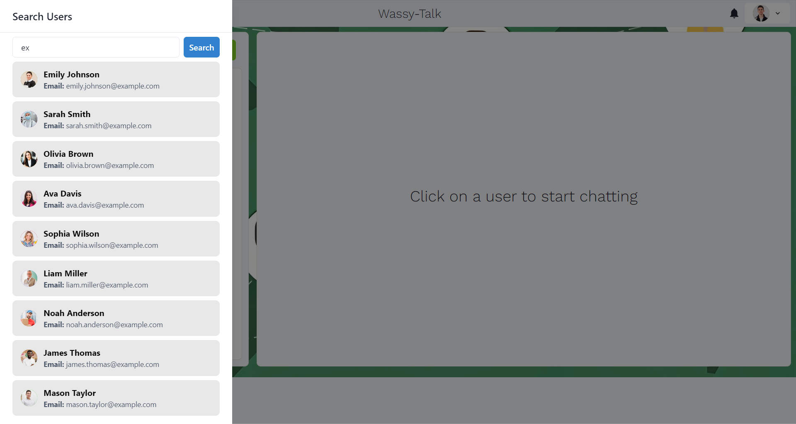
_Description: The user search interface allowing users to find and connect with others._

### Chat with User

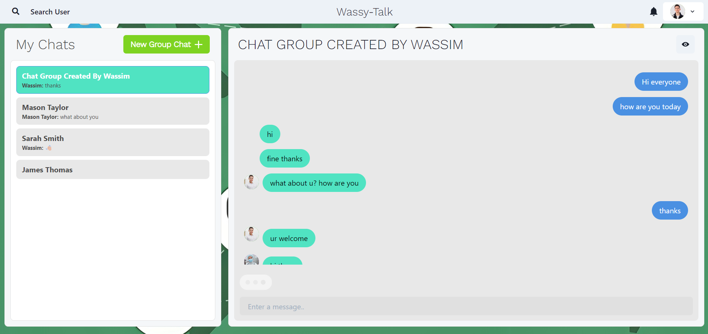
_Description: A one-on-one chat interface showing the conversation between two users._

### Chat with Group

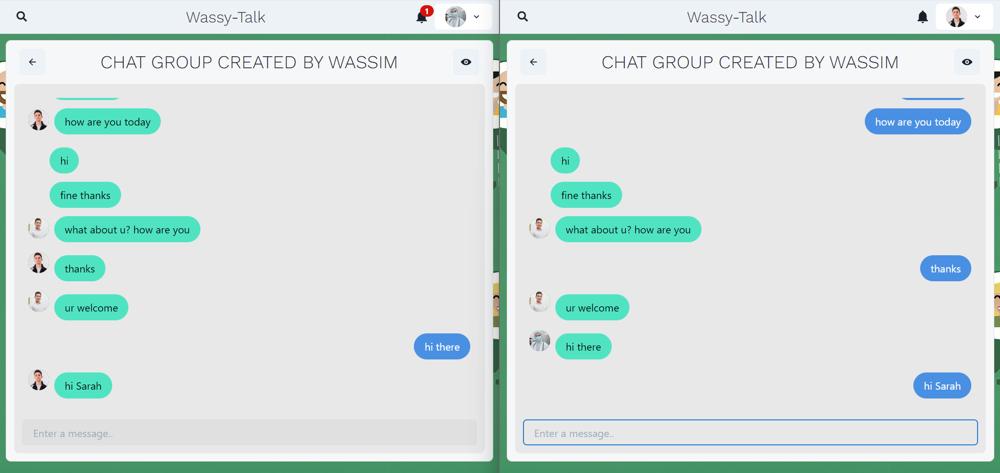
_Description: A group chat interface showing the conversation between multiple users._

### Create Chat Group

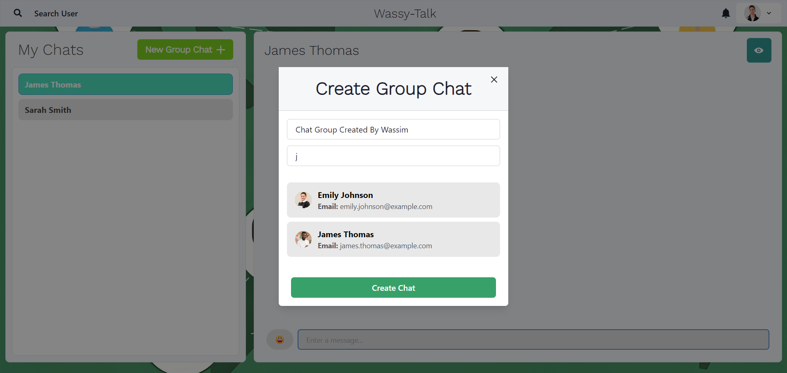
_Description: The interface for creating a new group chat, including adding members._

### Edit Chat Group

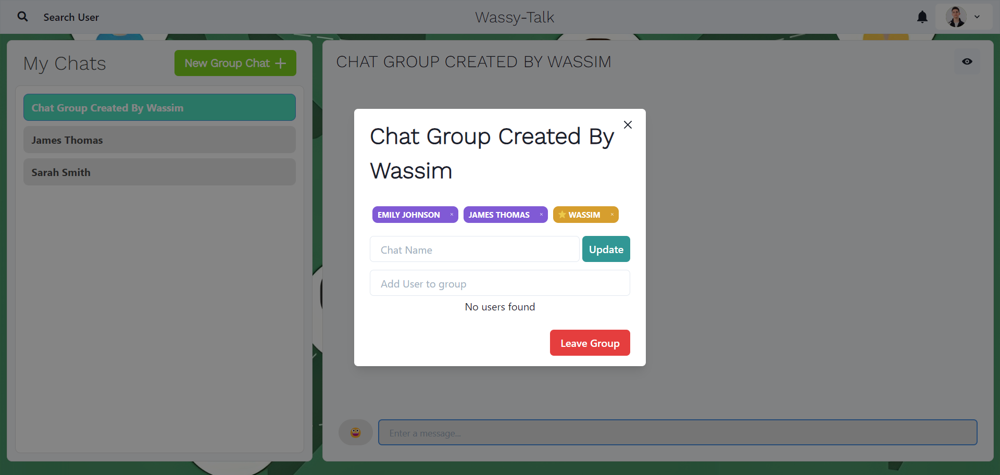
_Description: The group chat settings where users can modify group details or membership._

### Notifications

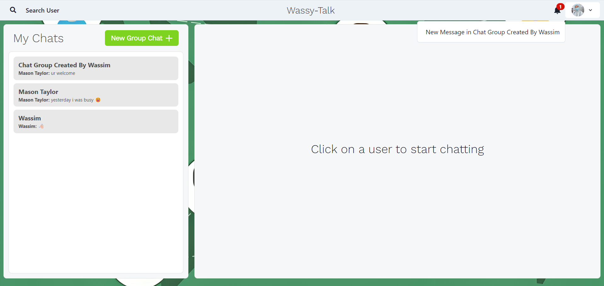
_Description: The notifications panel showing recent activities and messages._

### Mobile Responsive Design

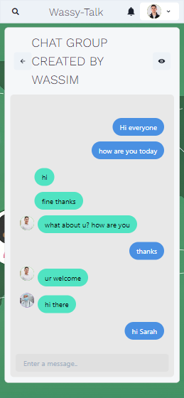
_Description: A view of the application on a mobile device, demonstrating responsive design._

## Tech Stack

- Frontend: React.js
- Backend: Node.js with Express.js
- Database: MongoDB
- Real-time Communication: Socket.IO
- Image Upload: Cloudinary

## Prerequisites

- Node.js (v14 or later)
- MongoDB
- npm or yarn package manager

## Installation

### Backend Setup

1. Clone the repository:

   ```
   git clone https://github.com/wassimOubaziz/PRODIGY_FS_04.git
   cd PRODIGY_FS_04
   ```

2. Install backend dependencies:

   ```
   npm install
   ```

3. Set up the `.env` file in the root directory (see [Environment Variables](#environment-variables) section).

### Frontend Setup

1. Navigate to the frontend directory:

   ```
   cd frontend
   ```

2. Install frontend dependencies:

   ```
   npm install --force
   ```

3. Set up the `.env` file in the frontend directory (see [Environment Variables](#environment-variables) section).

## Environment Variables

### Backend (.env in root directory)

```
PORT=5000
MONGO_URI=mongodb://localhost:27017/CHAT
JWT_SECRET=this_is_top_secret
CLOUD_NAME=qadkeils1ff
CLOUD_API_KEY=558866448987
CLOUD_API_SECRET=fd68-TdkjfbB8dkW2dlfdl
```

### Frontend (.env in frontend directory)

```
REACT_APP_CLOUDINARY_CLOUD_NAME=CLOUD_NAME=qadkeils1ff
REACT_APP_CLOUDINARY_UPLOAD_PRESET=upload_preset
```

## Running the Application

1. Start the backend server:

   ```
   npm start
   ```

   1.1. If you want to run the server in development mode, use the following command:

   ```
   npm run server
   ```

2. In a new terminal, start the frontend development server:

   ```
   cd frontend
   npm start
   ```

3. Access the application at `http://localhost:3000` in your web browser.

## API Endpoints

### User Routes

- `POST /api/user`: Register a new user
- `POST /api/user/login`: Authenticate a user
- `GET /api/user`: Get all users (protected route)
- `DELETE /api/user/remove`: Delete user account (protected route)
- `PUT /api/user/update`: Update user profile (protected route)

### Chat Routes

- `POST /api/chat`: Access or create a one-on-one chat (protected route)
- `GET /api/chat`: Fetch all chats for a user (protected route)
- `POST /api/chat/group`: Create a group chat (protected route)
- `PUT /api/chat/rename`: Rename a group (protected route)
- `PUT /api/chat/groupremove`: Remove user from group (protected route)
- `PUT /api/chat/groupadd`: Add user to group (protected route)

### Message Routes

- `GET /api/message/:chatId`: Get all messages for a specific chat (protected route)
- `POST /api/message`: Send a new message (protected route)

## Socket.IO Events

- `connection`: Establish socket connection
- `setup`: Set up user-specific room
- `join chat`: Join a specific chat room
- `typing`: Emit typing indicator
- `stop typing`: Stop typing indicator
- `new message`: Send and receive new messages

## Admin Functionality

Administrators in Wassy-Talk have enhanced capabilities to manage the application and its users. Here's what an admin can do:

1. User Management:

   - View all user accounts
   - Update user information
   - Delete user accounts
     //this blow is coming not now

2. Coming Soon

   1. Chat Moderation:

      - Access and monitor group chats
      - Remove inappropriate content
      - Dissolve group chats if necessary

   2. System Notifications:

      - Send system-wide notifications to all users
      - Announce updates or maintenance schedules

   3. Analytics:

      - View usage statistics
      - Monitor user engagement metrics

   4. Content Management:

      - Manage uploaded files and images
      - Set storage limits for users

   5. Security:
      - Monitor and manage user authentication attempts
      - Block or unblock IP addresses

To access admin functionality, an account must have the `isAdmin` flag set to `true` in the database.

## Contributing

Contributions are welcome! Please feel free to submit a Pull Request.

## License

This project is licensed under Wassim Oubaziz contact to use this repo.
